# Flows & Diagrams — User Registration & Authentication

| Field | Value |
|---|---|
| Feature ID | `01-user-registration` |
| Related BRD | [`brd.md`](./brd.md) |
| Related FSD | [`fsd.md`](./fsd.md) |
| Last updated | 2026-05-24 |

> All diagrams use **Mermaid** and render natively on GitHub. Edit the source
> blocks, not screenshots — diagrams are part of the spec.

---

## 0. Use Case Diagram

The classic BA view: **who** does **what**. Actors (boxes) interact with use cases (ovals) inside the system boundary. `«include»` shows a use case that another always uses (here, JWT validation is included by every authenticated flow); `«extend»` would show optional/conditional behavior. The actor on the right is a **supporting actor** — an external system the system depends on, not a human user.

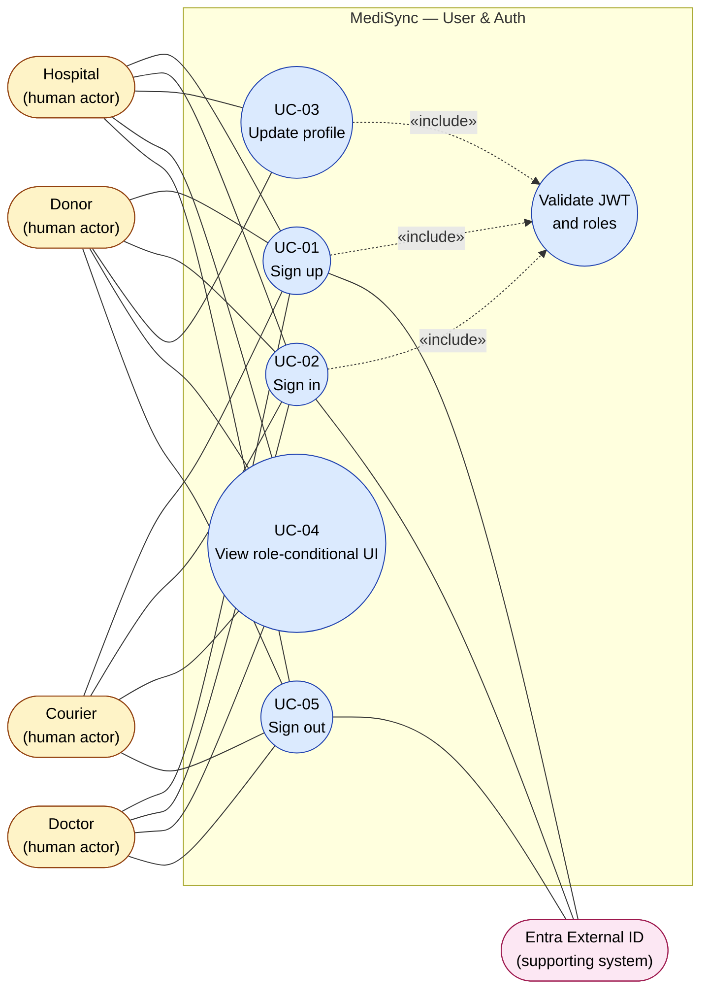
```mermaid
flowchart LR
    Hospital(["Hospital<br/>(human actor)"])
    Donor(["Donor<br/>(human actor)"])
    Courier(["Courier<br/>(human actor)"])
    Doctor(["Doctor<br/>(human actor)"])

    subgraph System["MediSync — User & Auth"]
        direction TB
        UC1(("UC-01<br/>Sign up"))
        UC2(("UC-02<br/>Sign in"))
        UC3(("UC-03<br/>Update profile"))
        UC4(("UC-04<br/>View role-conditional UI"))
        UC5(("UC-05<br/>Sign out"))
        UCInc(("Validate JWT<br/>and roles"))
    end

    Entra(["Entra External ID<br/>(supporting system)"])

    Hospital --- UC1
    Hospital --- UC2
    Hospital --- UC3
    Hospital --- UC4
    Hospital --- UC5

    Donor --- UC1
    Donor --- UC2
    Donor --- UC3
    Donor --- UC4
    Donor --- UC5

    Courier --- UC1
    Courier --- UC2
    Courier --- UC4
    Courier --- UC5

    Doctor --- UC1
    Doctor --- UC2
    Doctor --- UC4
    Doctor --- UC5

    UC1 -.->|"«include»"| UCInc
    UC2 -.->|"«include»"| UCInc
    UC3 -.->|"«include»"| UCInc

    UC1 --- Entra
    UC2 --- Entra
    UC5 --- Entra

    classDef actor fill:#fef3c7,stroke:#92400e,stroke-width:1px,color:#000;
    classDef usecase fill:#dbeafe,stroke:#1e40af,stroke-width:1px,color:#000;
    classDef support fill:#fce7f3,stroke:#9d174d,stroke-width:1px,color:#000;
    class Hospital,Donor,Courier,Doctor actor;
    class UC1,UC2,UC3,UC4,UC5,UCInc usecase;
    class Entra support;
```



**Reading the diagram:**

- **Primary actors (yellow boxes, left):** the four MediSync personas. Each line to a use case is a "participates in" association.
- **Use cases (blue ovals, inside the system boundary):** numbered to match UC-01…UC-05 in the [FSD](./fsd.md#3-use-cases).
- **«include» (dashed arrows):** Sign-up, Sign-in and Update-profile **all** include "Validate JWT and roles" — that's the cross-cutting auth concern factored out per UML convention.
- **Supporting actor (pink box, right):** Entra External ID is consulted by the auth-related use cases but is not a MediSync end user.
- **Courier and Doctor do not participate in Update-profile (UC-03)** in Phase 1 — they have no role-specific fields to edit. This is a deliberate scope decision visible at a glance.

---

## 1. Context Diagram

Shows the User Registration feature as a black box with its external actors and systems. This is the highest-level view a stakeholder needs to grasp what touches what.

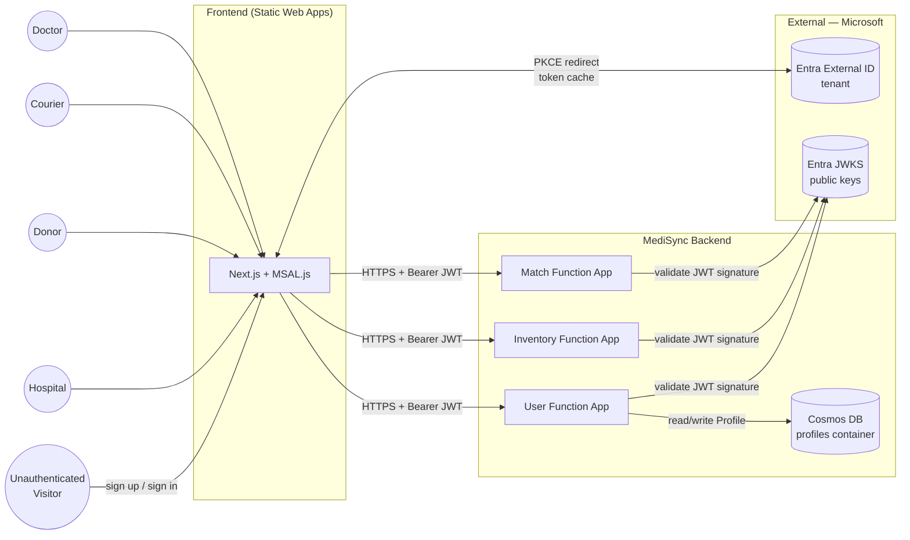
```mermaid
graph LR
    Visitor((Unauthenticated<br/>Visitor))
    Hospital((Hospital))
    Donor((Donor))
    Courier((Courier))
    Doctor((Doctor))

    subgraph Frontend["Frontend (Static Web Apps)"]
        Next[Next.js + MSAL.js]
    end

    subgraph MediSync["MediSync Backend"]
        UserFn[User Function App]
        InvFn[Inventory Function App]
        MatchFn[Match Function App]
        Cosmos[(Cosmos DB<br/>profiles container)]
    end

    subgraph External["External — Microsoft"]
        Entra[(Entra External ID<br/>tenant)]
        JWKS[(Entra JWKS<br/>public keys)]
    end

    Visitor -->|sign up / sign in| Next
    Hospital --> Next
    Donor --> Next
    Courier --> Next
    Doctor --> Next

    Next <-->|PKCE redirect<br/>token cache| Entra
    Next -->|HTTPS + Bearer JWT| UserFn
    Next -->|HTTPS + Bearer JWT| InvFn
    Next -->|HTTPS + Bearer JWT| MatchFn

    UserFn -->|validate JWT signature| JWKS
    InvFn -->|validate JWT signature| JWKS
    MatchFn -->|validate JWT signature| JWKS

    UserFn -->|read/write Profile| Cosmos
```



**Key reading:** The frontend talks to Entra for identity and to three Function Apps for domain operations. Every Function App validates tokens **offline** against the JWKS endpoint — there is no per-request call to Entra. Only the User Function App writes to the `profiles` container; Inventory and Match are pure consumers of the JWT's `oid` and `roles` claims.

---

## 2. Business Process Flow — Sign-up

Business-level view of UC-01. Swimlanes by actor.

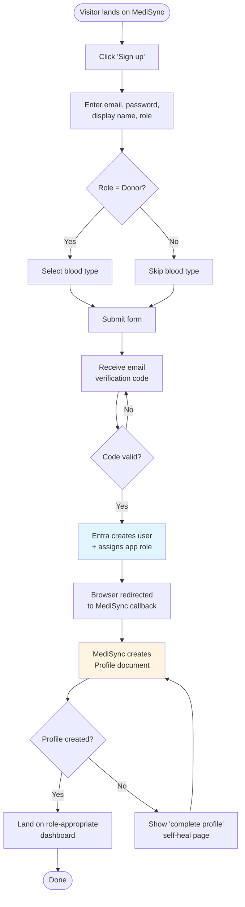
```mermaid
flowchart TD
    Start([Visitor lands on MediSync]) --> A[Click 'Sign up']
    A --> B[Enter email, password,<br/>display name, role]
    B --> C{Role = Donor?}
    C -- Yes --> D[Select blood type]
    C -- No --> E[Skip blood type]
    D --> F[Submit form]
    E --> F
    F --> G[Receive email<br/>verification code]
    G --> H{Code valid?}
    H -- No --> G
    H -- Yes --> I[Entra creates user<br/>+ assigns app role]
    I --> J[Browser redirected<br/>to MediSync callback]
    J --> K[MediSync creates<br/>Profile document]
    K --> L{Profile created?}
    L -- Yes --> M[Land on role-appropriate<br/>dashboard]
    L -- No --> N[Show 'complete profile'<br/>self-heal page]
    N --> K
    M --> End([Done])

    style I fill:#e1f5ff
    style K fill:#fff4e1
```



**Legend:** blue = Entra-owned step, orange = MediSync-owned step, white = visitor action.

---

## 3. Sequence Diagram — Sign-up End-to-End (UC-01)

The technical wire-level view. Numbered for traceability back to the use case main flow.

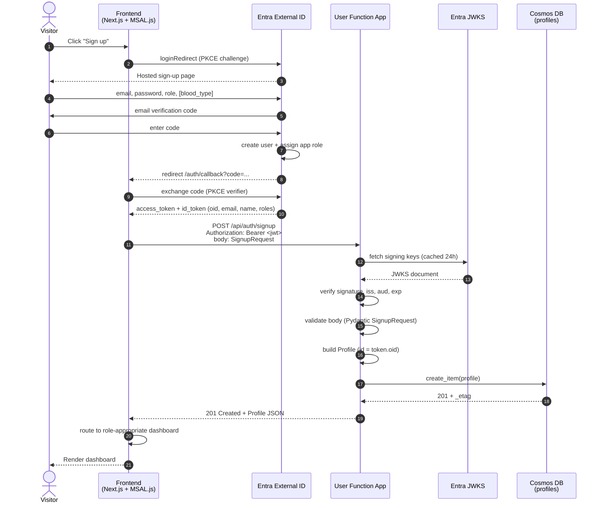
```mermaid
sequenceDiagram
    autonumber
    actor V as Visitor
    participant FE as Frontend<br/>(Next.js + MSAL.js)
    participant Entra as Entra External ID
    participant UserFn as User Function App
    participant JWKS as Entra JWKS
    participant Cosmos as Cosmos DB<br/>(profiles)

    V->>FE: Click "Sign up"
    FE->>Entra: loginRedirect (PKCE challenge)
    Entra-->>V: Hosted sign-up page
    V->>Entra: email, password, role, [blood_type]
    Entra->>V: email verification code
    V->>Entra: enter code
    Entra->>Entra: create user + assign app role
    Entra-->>FE: redirect /auth/callback?code=...
    FE->>Entra: exchange code (PKCE verifier)
    Entra-->>FE: access_token + id_token (oid, email, name, roles)

    FE->>UserFn: POST /api/auth/signup<br/>Authorization: Bearer <jwt><br/>body: SignupRequest
    UserFn->>JWKS: fetch signing keys (cached 24h)
    JWKS-->>UserFn: JWKS document
    UserFn->>UserFn: verify signature, iss, aud, exp
    UserFn->>UserFn: validate body (Pydantic SignupRequest)
    UserFn->>UserFn: build Profile (id = token.oid)
    UserFn->>Cosmos: create_item(profile)
    Cosmos-->>UserFn: 201 + _etag
    UserFn-->>FE: 201 Created + Profile JSON

    FE->>FE: route to role-appropriate dashboard
    FE-->>V: Render dashboard
```

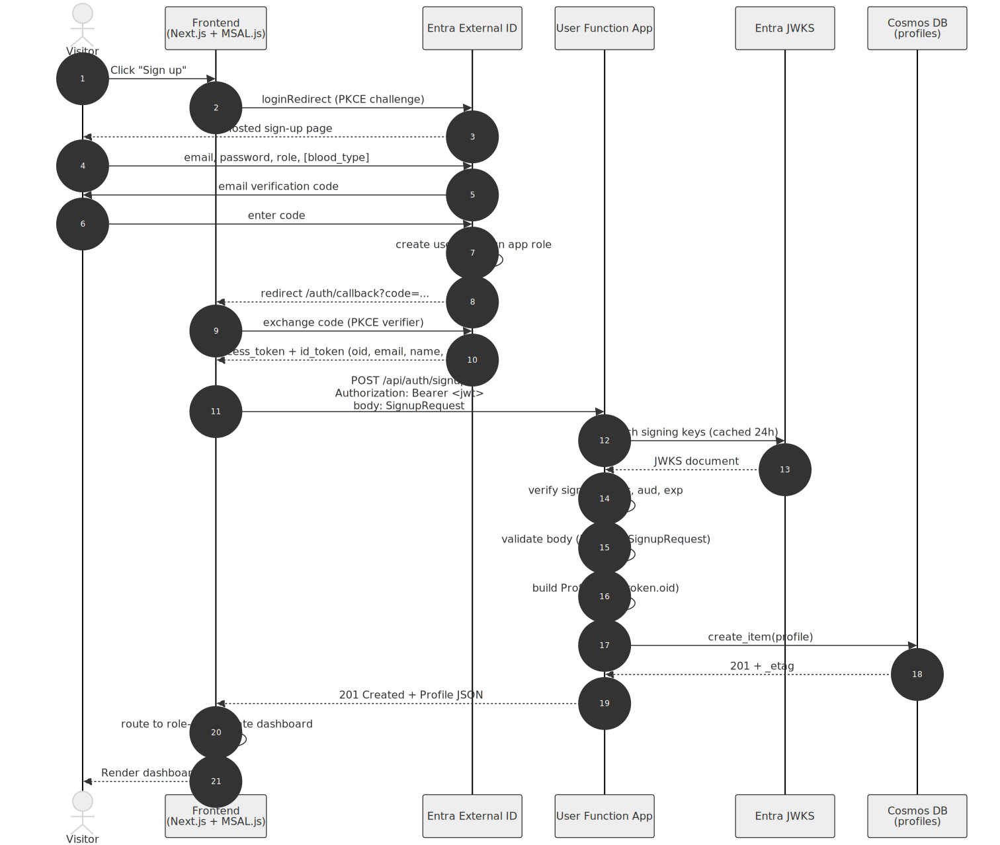

---

## 4. Sequence Diagram — Returning Sign-in (UC-02)

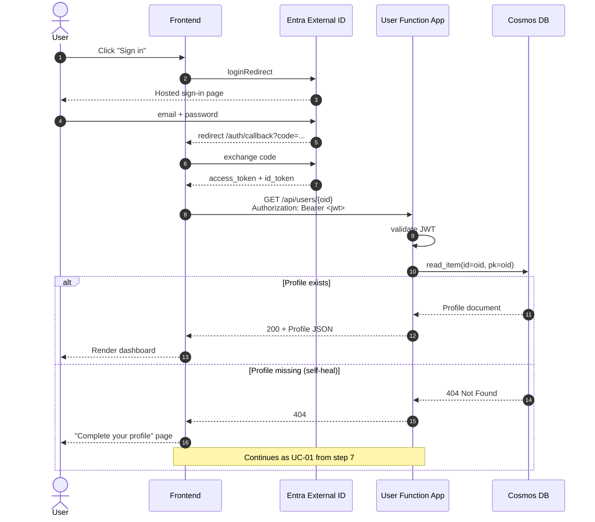
```mermaid
sequenceDiagram
    autonumber
    actor U as User
    participant FE as Frontend
    participant Entra as Entra External ID
    participant UserFn as User Function App
    participant Cosmos as Cosmos DB

    U->>FE: Click "Sign in"
    FE->>Entra: loginRedirect
    Entra-->>U: Hosted sign-in page
    U->>Entra: email + password
    Entra-->>FE: redirect /auth/callback?code=...
    FE->>Entra: exchange code
    Entra-->>FE: access_token + id_token

    FE->>UserFn: GET /api/users/{oid}<br/>Authorization: Bearer <jwt>
    UserFn->>UserFn: validate JWT
    UserFn->>Cosmos: read_item(id=oid, pk=oid)

    alt Profile exists
        Cosmos-->>UserFn: Profile document
        UserFn-->>FE: 200 + Profile JSON
        FE-->>U: Render dashboard
    else Profile missing (self-heal)
        Cosmos-->>UserFn: 404 Not Found
        UserFn-->>FE: 404
        FE-->>U: "Complete your profile" page
        Note over FE,UserFn: Continues as UC-01 from step 7
    end
```

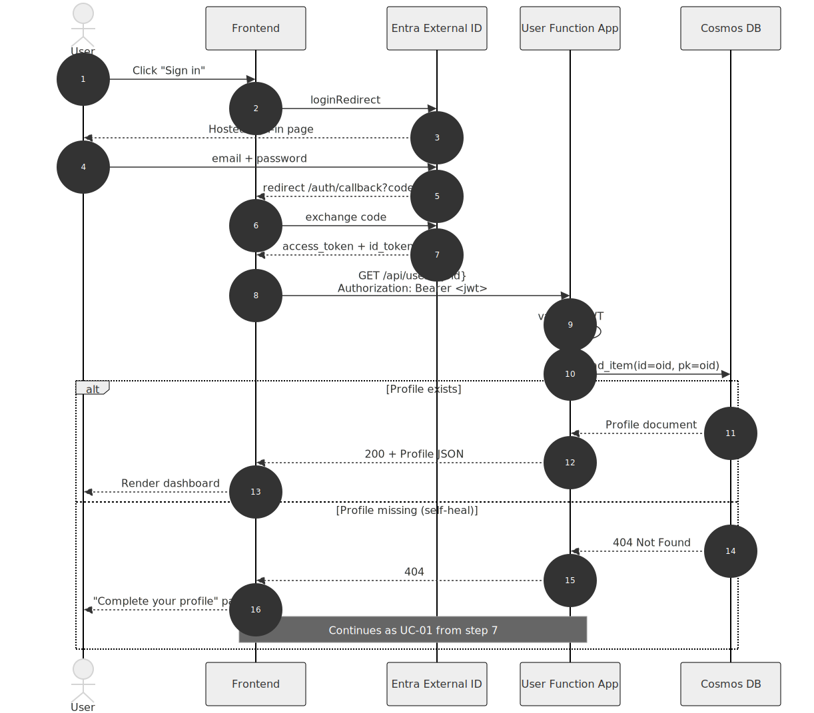

---

## 5. Sequence Diagram — Profile Update with ETag Conflict (UC-03)

Shows the optimistic-locking happy path and the 409 retry loop.

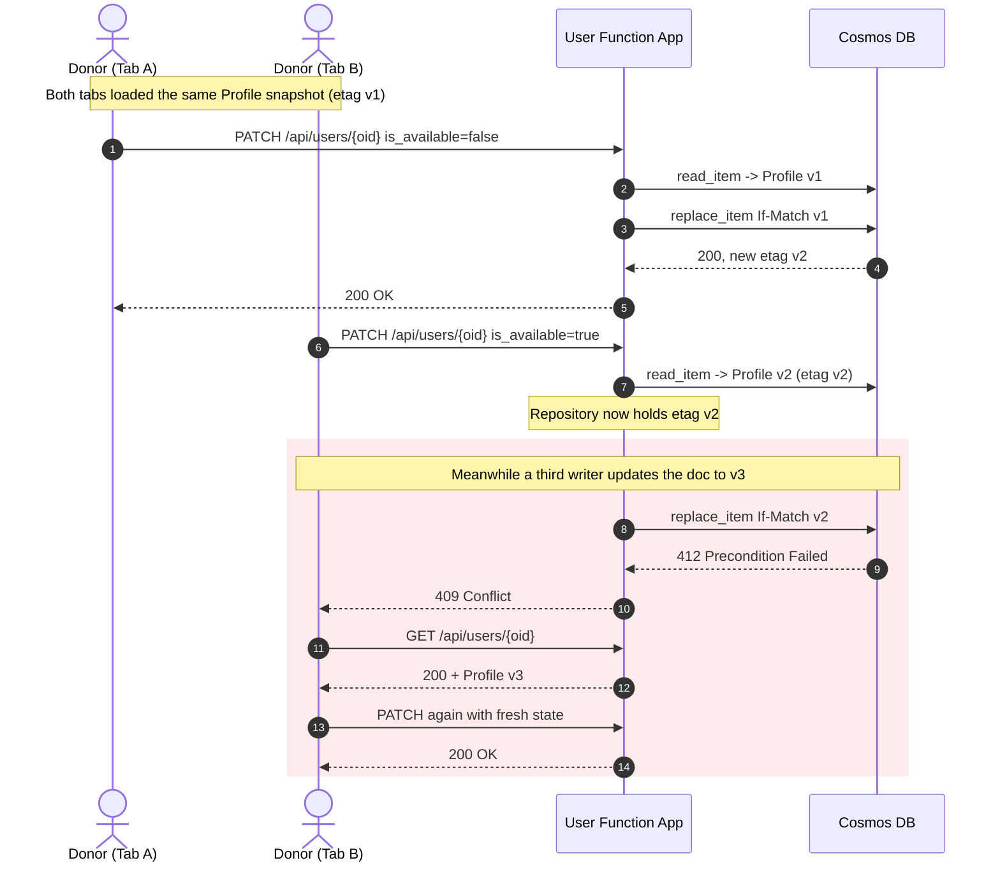
```mermaid
sequenceDiagram
    autonumber
    actor U1 as Donor (Tab A)
    actor U2 as Donor (Tab B)
    participant API as User Function App
    participant DB as Cosmos DB

    Note over U1,U2: Both tabs loaded the same Profile snapshot (etag v1)

    U1->>API: PATCH /api/users/{oid} is_available=false
    API->>DB: read_item -> Profile v1
    API->>DB: replace_item If-Match v1
    DB-->>API: 200, new etag v2
    API-->>U1: 200 OK

    U2->>API: PATCH /api/users/{oid} is_available=true
    API->>DB: read_item -> Profile v2 (etag v2)
    Note over API: Repository now holds etag v2

    rect rgb(255, 235, 235)
        Note over U2,DB: Meanwhile a third writer updates the doc to v3
        API->>DB: replace_item If-Match v2
        DB-->>API: 412 Precondition Failed
        API-->>U2: 409 Conflict
        U2->>API: GET /api/users/{oid}
        API-->>U2: 200 + Profile v3
        U2->>API: PATCH again with fresh state
        API-->>U2: 200 OK
    end
```

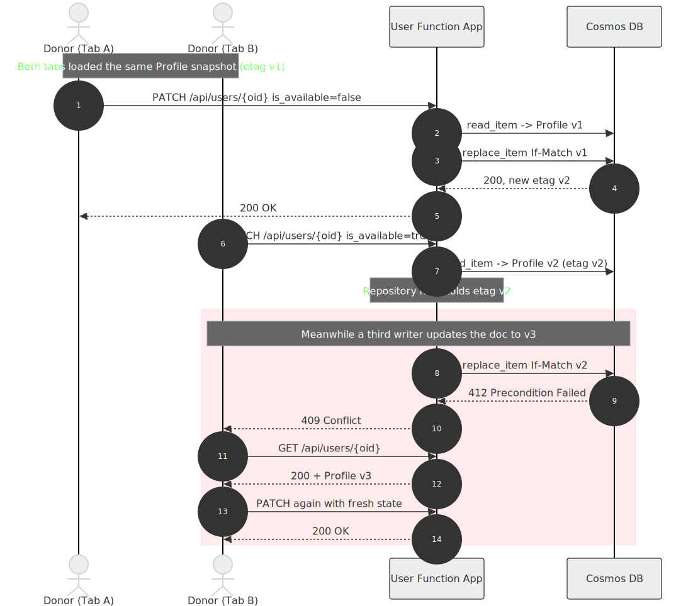

---

## 6. Sequence Diagram — Cross-Service Authorization (US-05)

Demonstrates how the JWT issued by the User-registration flow is consumed by **other** services.

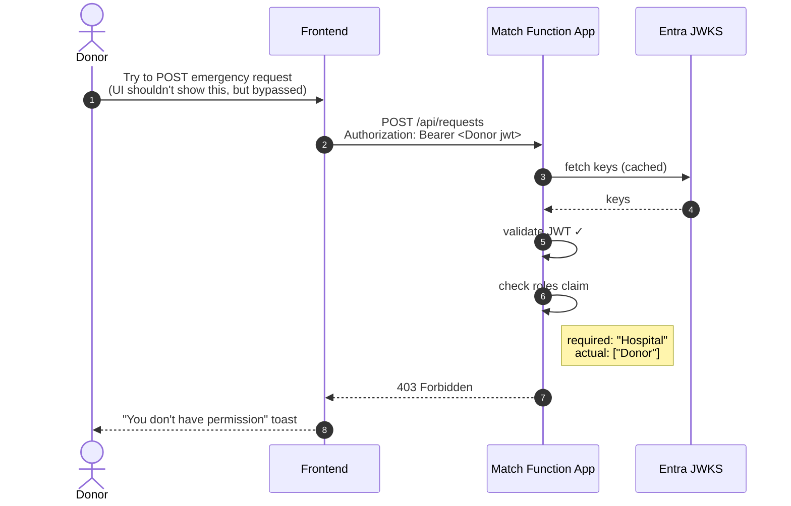
```mermaid
sequenceDiagram
    autonumber
    actor D as Donor
    participant FE as Frontend
    participant MatchFn as Match Function App
    participant JWKS as Entra JWKS

    D->>FE: Try to POST emergency request<br/>(UI shouldn't show this, but bypassed)
    FE->>MatchFn: POST /api/requests<br/>Authorization: Bearer <Donor jwt>
    MatchFn->>JWKS: fetch keys (cached)
    JWKS-->>MatchFn: keys
    MatchFn->>MatchFn: validate JWT ✓
    MatchFn->>MatchFn: check roles claim
    Note right of MatchFn: required: "Hospital"<br/>actual: ["Donor"]
    MatchFn-->>FE: 403 Forbidden
    FE-->>D: "You don't have permission" toast
```

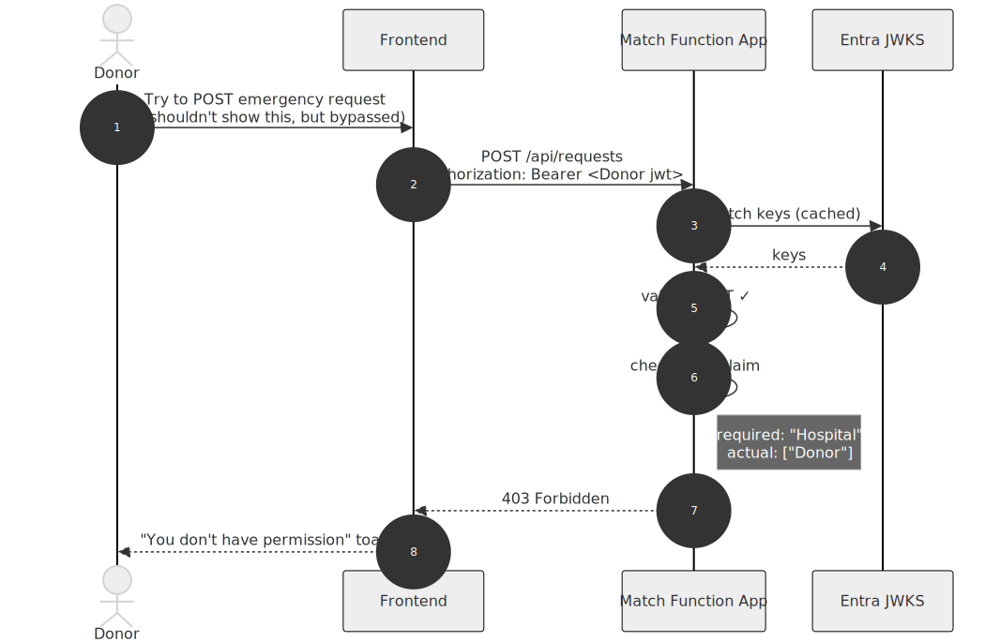

---

## 7. State Diagram — Profile Lifecycle

A `Profile` document moves through these states. `Pending` exists only as the transient half-second between Entra issuing the token and `POST /api/auth/signup` returning 201.

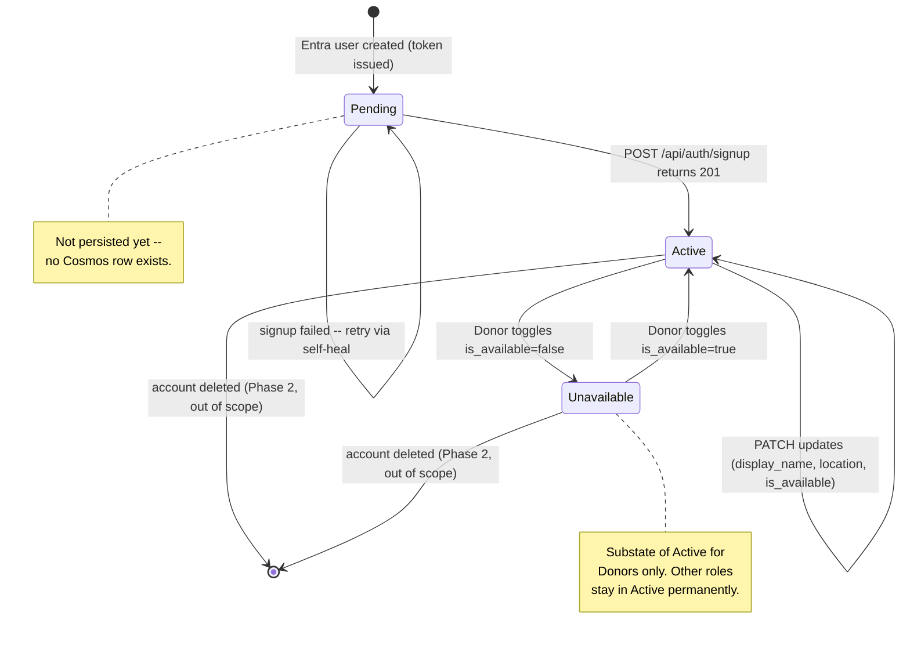
```mermaid
stateDiagram-v2
    [*] --> Pending: Entra user created (token issued)
    Pending --> Active: POST /api/auth/signup returns 201
    Pending --> Pending: signup failed -- retry via self-heal
    Active --> Active: PATCH updates (display_name, location, is_available)
    Active --> Unavailable: Donor toggles is_available=false
    Unavailable --> Active: Donor toggles is_available=true
    Active --> [*]: account deleted (Phase 2, out of scope)
    Unavailable --> [*]: account deleted (Phase 2, out of scope)

    note right of Pending
        Not persisted yet --
        no Cosmos row exists.
    end note

    note right of Unavailable
        Substate of Active for
        Donors only. Other roles
        stay in Active permanently.
    end note
```



---

## 8. Data Flow Diagram — Sign-up

Where data physically moves during a sign-up.

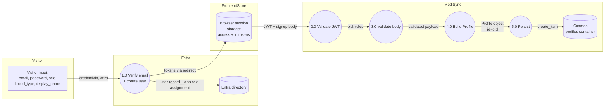
```mermaid
flowchart LR
    subgraph Visitor
        V[Visitor input:<br/>email, password, role,<br/>blood_type, display_name]
    end

    subgraph Entra
        P1((1.0 Verify email<br/>+ create user))
        D1[(Entra directory)]
    end

    subgraph FrontendStore
        TC[(Browser session<br/>storage:<br/>access + id tokens)]
    end

    subgraph MediSync
        P2((2.0 Validate JWT))
        P3((3.0 Validate body))
        P4((4.0 Build Profile))
        P5((5.0 Persist))
        D2[(Cosmos<br/>profiles container)]
    end

    V -->|credentials, attrs| P1
    P1 -->|user record + app-role assignment| D1
    P1 -->|tokens via redirect| TC

    TC -->|JWT + signup body| P2
    P2 -->|oid, roles| P3
    P3 -->|validated payload| P4
    P4 -->|Profile object<br/>id=oid| P5
    P5 -->|create_item| D2
```



**PII boundary:** the only PII that crosses into MediSync's data store is `email`, `display_name`, and (optionally) `location`. Passwords never leave Entra. Logs in P2–P5 reference `id` and `role` only — never `email`.

---

## 9. Sequence Diagram — JWT Validation Internal Detail

Pulled out separately because three services do this identically and a reviewer will want to see the validation logic concretely.

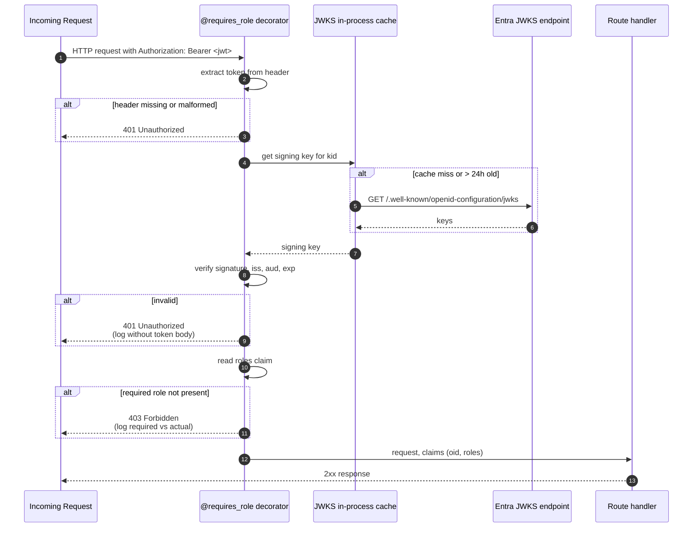
```mermaid
sequenceDiagram
    autonumber
    participant Req as Incoming Request
    participant MW as @requires_role decorator
    participant Cache as JWKS in-process cache
    participant JWKS as Entra JWKS endpoint
    participant Handler as Route handler

    Req->>MW: HTTP request with Authorization: Bearer <jwt>
    MW->>MW: extract token from header
    alt header missing or malformed
        MW-->>Req: 401 Unauthorized
    end

    MW->>Cache: get signing key for kid
    alt cache miss or > 24h old
        Cache->>JWKS: GET /.well-known/openid-configuration/jwks
        JWKS-->>Cache: keys
    end
    Cache-->>MW: signing key

    MW->>MW: verify signature, iss, aud, exp
    alt invalid
        MW-->>Req: 401 Unauthorized<br/>(log without token body)
    end

    MW->>MW: read roles claim
    alt required role not present
        MW-->>Req: 403 Forbidden<br/>(log required vs actual)
    end

    MW->>Handler: request, claims (oid, roles)
    Handler-->>Req: 2xx response
```

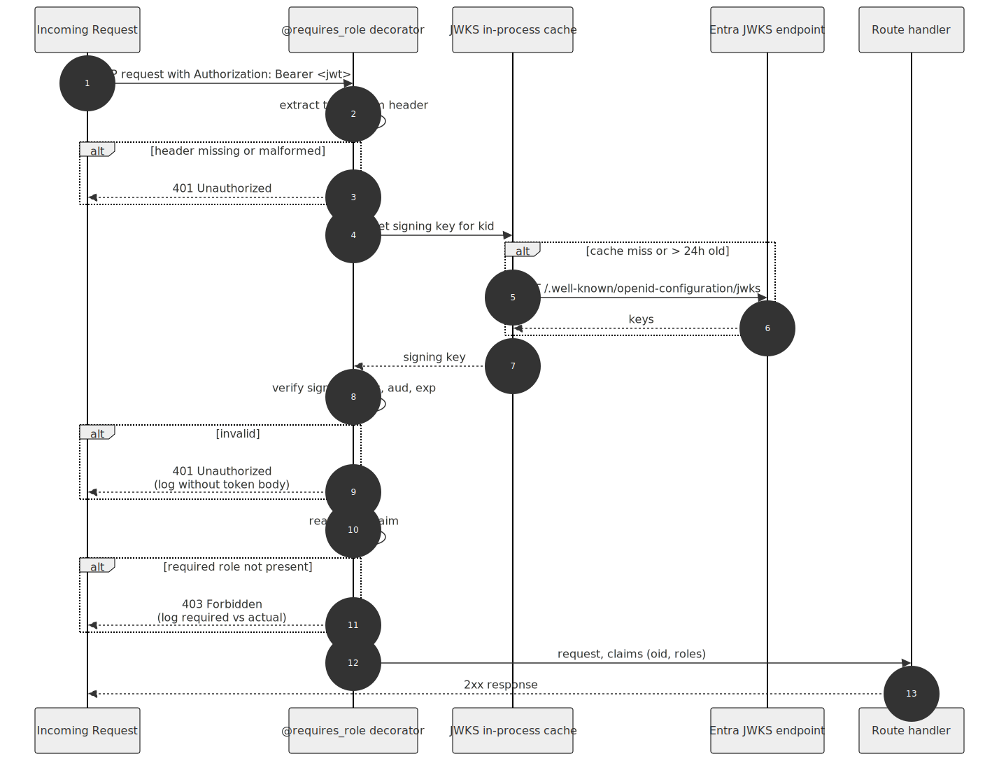

---

## 10. Notes & Next Diagrams

- **Application Map screenshot:** once deployed, replace this note with a screenshot of the Application Insights Application Map showing Frontend → User Function → Cosmos and Frontend → Match/Inventory Functions.
- **Entra hosted page screenshots:** add a screenshot of the customized sign-up page once branding is applied (runbook 10 step 7).
- **ERD:** not included — only one entity (`Profile`) exists in this feature's scope. Will appear in feature 02 (Inventory) where multiple entities relate.
- **Diagrams to refresh** when implementation changes the wire contracts: §1 (context), §3 (sign-up sequence), §6 (cross-service auth). The state diagram in §7 should only change if profile lifecycle gains states.
