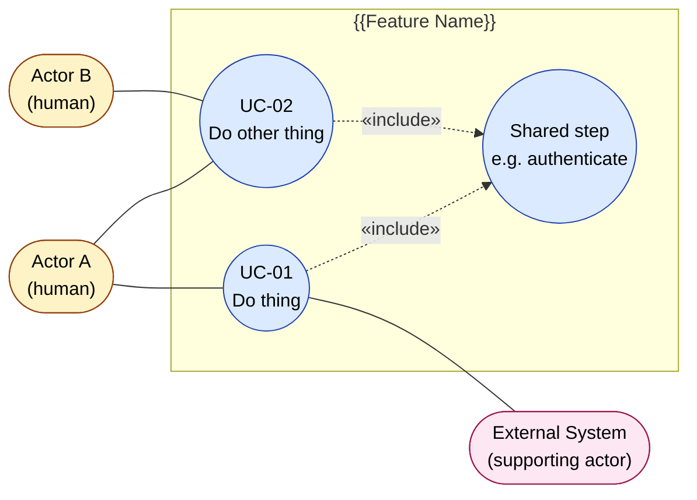
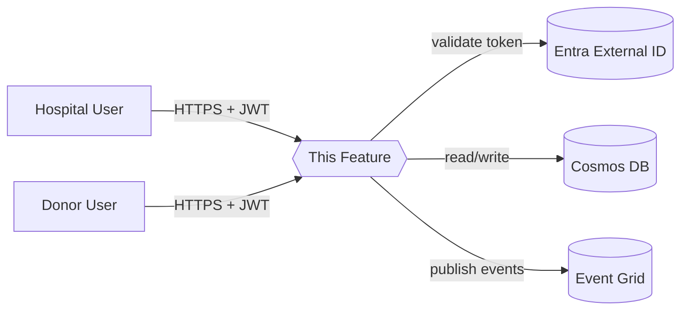
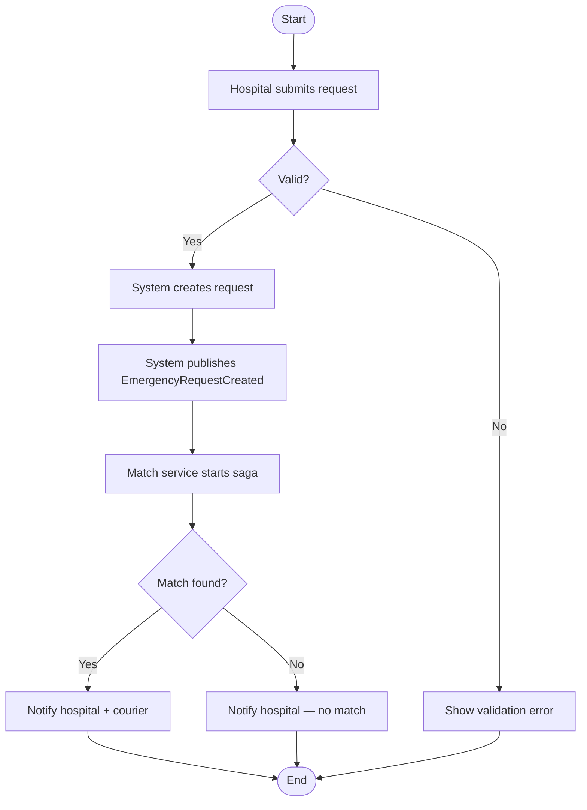
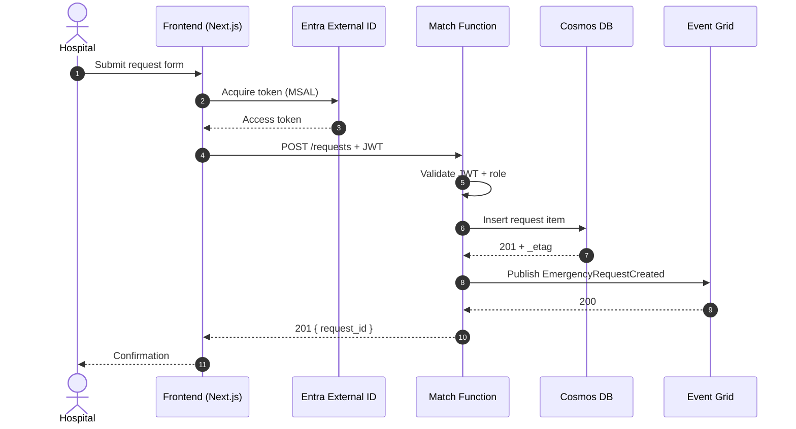
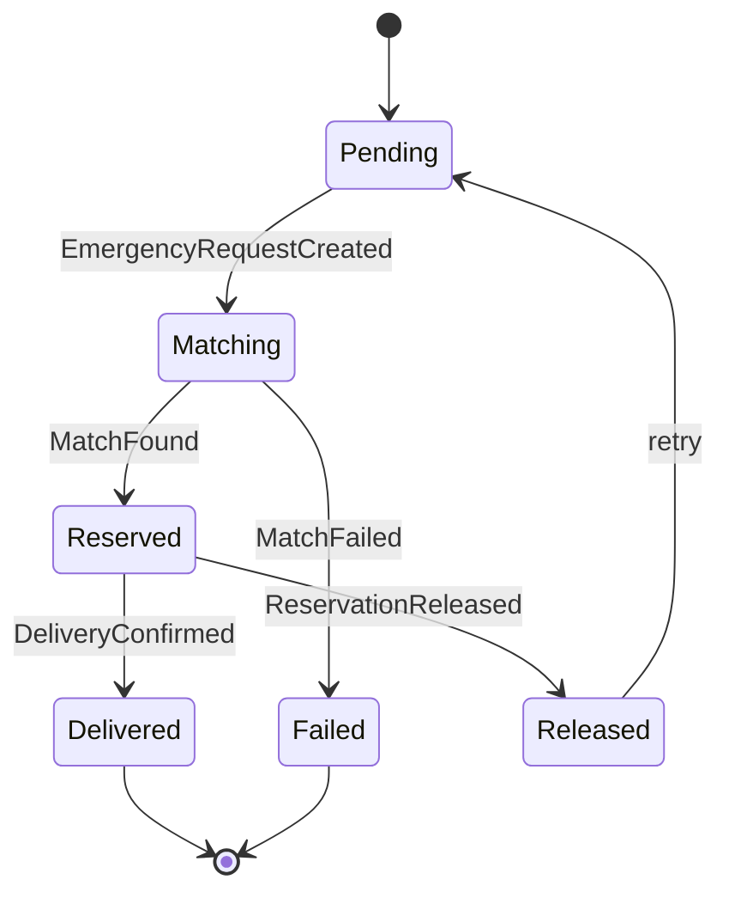
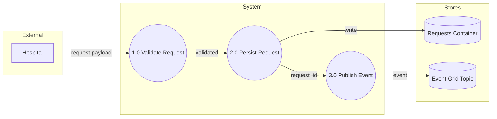

# Flows & Diagrams — {{Feature Name}}

| Field | Value |
|---|---|
| Feature ID | `NN-feature-slug` |
| Related BRD | [`brd.md`](./brd.md) |
| Related FSD | [`fsd.md`](./fsd.md) |
| Last updated | YYYY-MM-DD |

> All diagrams use **Mermaid** as the source of truth and are also exported
> to SVG (see `docs/ba/README.md` → "Diagram rendering"). After editing
> any block below, run `npm run render:diagrams` from the repo root to
> refresh the sibling `flows/*.svg` files.
>
> Section numbering doubles as the filename prefix — `## 3. X` renders to
> `flows/03-x.svg`. Keep section numbers stable when adding diagrams later.

---

## 0. Use Case Diagram

Classic UML view: actors (boxes) interact with use cases (ovals) inside the system boundary. Use `«include»` for behavior another use case always invokes, `«extend»` for optional/conditional extension.

---

## 1. Context Diagram

Shows the feature as a black box with its external actors and systems.

## 2. Process Flow (Business Process)

Business-level steps. Swimlanes by actor.

## 3. Sequence Diagram (Technical)

Shows the order of calls between components.

## 4. State Diagram (optional — add if entity has lifecycle)

## 5. Data Flow Diagram (optional)

## 6. Notes

- Add links to App Insights screenshots / Application Map images once implemented.
- Update diagrams when the FSD changes — they are part of the spec, not decoration.
